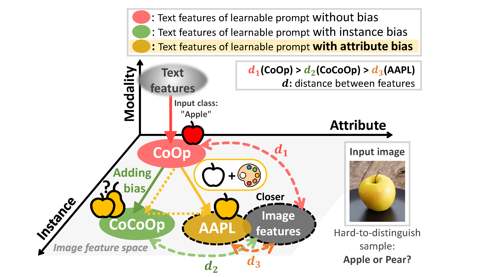

# AAPL: Adding Attributes to Prompt Learning for Vision-Language Models

Authors: *Gahyeon Kim*\* , *Sohee Kim*\*, *Seokju Lee*  

( \* : joint first authors)

**arXiv paper:** [AAPL: Adding Attributes to Prompt Learning for Vision-Language Models]()

This repository is the official implementation of the CVPR Workshop 2024 paper.

> **Abstract:** *Recent advances in large pre-trained vision-language models have demonstrated remarkable performance on zero-shot downstream tasks. Building upon this, recent studies, such as CoOp and CoCoOp, have proposed the use of prompt learning, where context within a prompt is replaced with learnable vectors, leading to significant improvements over manually crafted prompts. However, the performance improvement for unseen classes is still marginal, and to tackle this problem, data augmentation has been frequently used in traditional zero-shot learning techniques. Through our experiments, we have identified important issues in CoOp and CoCoOp: the context learned through traditional image augmentation is biased toward seen classes, negatively impacting generalization to unseen classes. To address this problem, we propose adversarial token embedding to disentangle low-level visual augmentation features from high-level class information when inducing bias in learnable prompts. Through our novel mechanism called "Adding Attributes to Prompt Learning", [AAPL](), we guide the learnable context to effectively extract text features by focusing on high-level features for unseen classes. We have conducted experiments across 11 datasets, and overall, AAPL shows favorable performances compared to the existing methods in few-shot learning, zero-shot learning, cross-dataset, and domain generalization tasks.*



>Training the learnable prompt on the class "apple", since the training data mainly consists of red apples, leads to understanding apples as typically red. When a rare "yellow apple” is input, the instance bias may overlook the yellow attribute and incorrectly predict it as a pear. However, AAPL extracts and decomposes attributes from the image, enhancing attribute-specific bias in the semantic features. 
>This enables robustly improved generalization performance across domains.

---

## How to Run

### Installation

> AAPL is identical to all installation settings for [CoOp and CoCoOp](https://github.com/KaiyangZhou/CoOp?tab=readme-ov-file). 
> Refer to the following repository for a detailed installation and data preparation guide.

- This code is built on top of the awesome toolbox [Dassl.pytorch](https://github.com/KaiyangZhou/Dassl.pytorch) so you need to install the `dassl` environment first. Simply follow the instructions described [here](https://github.com/KaiyangZhou/Dassl.pytorch#installation) to install `dassl` as well as PyTorch. After that, run `pip install -r requirements.txt` under `AAPL/` to install a few more packages required by [CLIP](https://github.com/openai/CLIP) (this should be done when `dassl` is activated). 

- Follow the details in [DATASETS.md](https://github.com/KaiyangZhou/CoOp/blob/main/DATASETS.md) in CoOp GitHub repository to install the data.
  - **Dataset List:** ImageNet, Caltech101, OxfordPets, StandfordCars, Flowers102, Food101, FGVCAircraft, SUN397, DTD, EuroSAT, UCF101, ImageNetV2, ImageNet-A, ImageNet-R
  - If you encounter errors when using the ImageNet download link provided in DATASET.md, make sure to use the [ILSVRC2012 version](https://image-net.org/challenges/LSVRC/2012/2012-downloads.php) of ImageNet and [Stanford Cars Dataset](https://www.kaggle.com/datasets/jessicali9530/stanford-cars-dataset) in kaggle for training.

### Setup

``````python
git clone https://github.com/Gahyeonkim09/AAPL.git
cd AAPL
``````

### Running AAPL

All experiments were conducted with `attr_init = ""` (no initialization), `n_attr = 4`, and the backbone was trained with `ViT-B/16`. Please refer to the Experiment section of the paper for other parameter settings.

- **Generalization from Base2New classes**

   In the Base2New generalization experiment, few-shot learning is conducted with 16 shots per class (base classes), and evaluation is performed on samples unseen (new classes) during training. In `DATASET_NAME`, you should input the name of the dataset you want to train on or test on. 
  (e.g., `DATASET_NAME = {imageNet, caltech101, oxford_pets, standford_cars, flowers102, food101, fgvc_aircraft, sun397, dtd, eurosat, ucf101}`).

  ``````bash
  for SEED in 1 2 3
  do
      bash scripts/aapl/base2new_train.sh DATASET_NAME ${SEED}
      bash scripts/aapl/base2new_test.sh DATASET_NAME ${SEED}
  done
  ``````

- **Cross-Dataset Transfer**

  After training on all classes of ImageNet, you then test on the remaining 10 datasets used in the Base2New generalization experiment to evaluate cross-data transfer performance.

  ``````bash
  for SEED in 1 2 3
  do
      bash scripts/aapl/xd_train.sh ${SEED}
  done
  ``````

  ``````bash
  for SEED in 1 2 3
  do
      bash scripts/aapl/xd_test.sh DATASET_NAME ${SEED}
  done
  ``````

- **Domain Generalization**

  Similar to "Cross-Dataset Transfer," you evaluate the trained model trained on ImageNet on a variant dataset of ImageNet (i.e., `DATASET_NAME = {imagenetv2, imagenet_sketch, imagenet_a, imagenet_r}`).

  ``````bash
  for SEED in 1 2 3
  do
      bash scripts/aapl/xd_test.sh DATASET_NAME ${SEED}
  done
  ``````

### Visualization

During AAPL training, t-SNE and the silhouette score are used at each epoch to visualize the clustering of delta meta token augmentation types. You can visualize the t-SNE and silhouette scores of delta meta tokens from the last epoch.

``````bash
bash scripts/aapl/base2new_train_visualize.sh DATASET_NAME ${SEED}
``````

---

## Highlights

We propose AAPL (Adding Attributes to Prompt Learning), which extracts and decomposes attributes from the image, enhancing attribute-specific bias in the semantic features.

1. **Delta meta token: detach attribute feature**

   *Delta meta tokens* are obtained by subtracting meta tokens from augmented image features and original image features. These delta meta tokens are then used to ensure clustering between augmentations using *AdTriplet loss*, thereby decomposing a bias between attributes and semantics.

   - **Does the delta meta token have exact augmentation information?**

   - The difference between CoCoOp, which incorporates instance bias, and AAPL, which utilizes decomposed attribute bias, lies in their augmentation strategies. AAPL's approach leads to the overall improvement in generalization performance across datasets.

     | Name                     | Base Acc. | Novel Acc. |    HM     |
     | :----------------------- | :-------: | :--------: | :-------: |
     | [CLIP]()                 |   69.34   | **74.22**  |   71.70   |
     | [CoOp]()                 | **82.69** |   63.22    |   71.66   |
     | [CoCoOp]()               |   80.47   |   71.69    |   75.83   |
     | CoCoOp with augmentation |   79.25   |   70.89    |   74.38   |
     | [AAPL]() (ours)          |   80.27   |   72.17    | **76.01** |

2. **Augmentation Profiling**

   AAPL's results were compared and analyzed across datasets, revealing a tendency for specific bias dependency (i.e., attribute-specific, instance-specific) in each dataset. Furthermore, the impact of AAPL was analyzed across augmentation types, highlighting the importance of effectively utilizing image augmentation in prompt learning.

---

## Contact

If you have any questions, please create an issue on this repository or contact us at 
[gahyeon@kentech.ac.kr](mailto:gahyeon@kentech.ac.kr) or [soheekim@kentech.ac.kr](mailto:soheekim@kentech.ac.kr).

## Acknowledgment

Our code is based on [CoCoOp and CoOp](https://github.com/KaiyangZhou/CoOp) repository. We thank the authors for releasing their code. If you use our model and code, please consider citing these works as well.

> This work was partly supported by Institute of Information & communications Technology Planning & Evaluation (IITP) grant funded by the Korea government(MSIT) (No.2021-0-02068, Artificial Intelligence Innovation Hub), (No.2022-0-00124, Development of Artificial Intelligence Technology for Self-Improving Competency-Aware Learning Capabilities), and (No. 2020-0-00004, Development of Previsional Intelligence based on Long-term Visual Memory Network).
